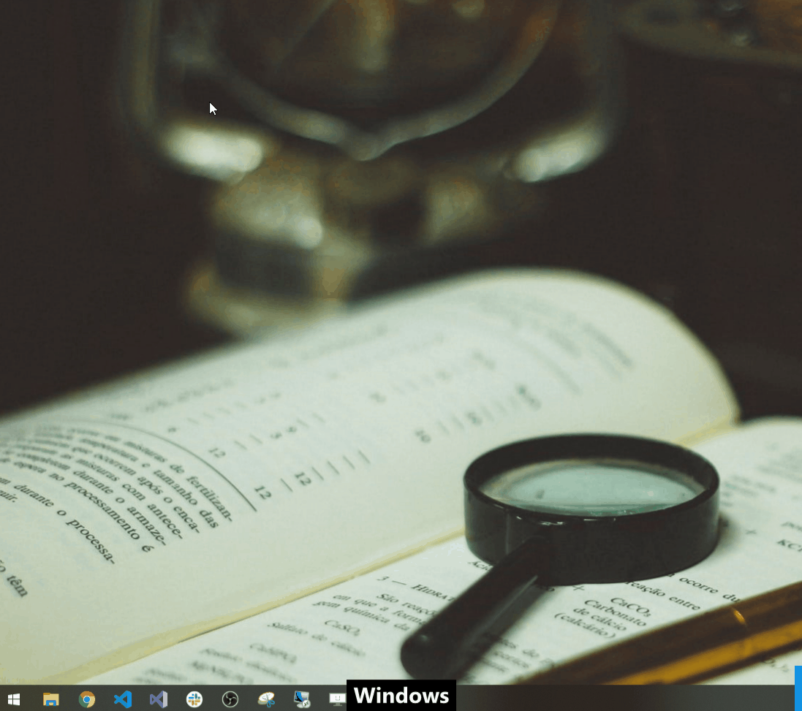

# Usage - New Machine Setup

New dev/ machine- need setup? [Install Chocolatey](https://chocolatey.org/install) and then Choco install. 
This script was designed for students and professionals setting up a new development environment.

# Software Included

<details>
<summary>
Details
</summary>

**IDEs**
*  Visual Studio Code
*  Notepad Plus Plus
*  Atom
*  Submlime Text
*  Brackets

**Frameworks**
*  dotnet Core SDK

**SQL**
*  SQL Server Management Studio
*  MySQL Workbench

**Utilities**
*  AWS CLI
*  Azure CLI
*  GIT CLI
*  cURL
*  NodeJS
*  yarn
*  terraform

**Tools**
*  Postman
*  Fiddler
*  Beyond Compare
*  cmder
*  Omnisharp for VS Code

**Programs**
*  7 Zip
*  FileZilla
*  SourceTree
*  Slack

**Browsers**
*  Google Chrome
*  FireFox

---

</details>

# Getting Setup 

## Step 1) Run Powershell as Administrator

<details>
<summary>How to run Powershell as Adminsitrator?

</summary>

1.  Open Start Menu
2.  Search for Powershell
3.  Right Click on Powershell
4.  Left Click 'Run as Administrator



</details>

## Step 2) Install Chocolatey

Executeing this command in powershell with 'Admin' privlidges will install Chocolatey Package Manager.

```ps
Set-ExecutionPolicy Bypass -Scope Process -Force; [System.Net.ServicePointManager]::SecurityProtocol = [System.Net.ServicePointManager]::SecurityProtocol -bor 3072; iex ((New-Object System.Net.WebClient).DownloadString('https://chocolatey.org/install.ps1'))
```

## Step 3) Install Everything Else

Executeing this command in powershell with 'Admin' privlidges will install all of the software documented in the [Chocolatey Machine Setup](https://raw.githubusercontent.com/dvdmrk/GreenDevMachineConfig/master/chocolatey-machine-setup.ps1) Powershell script.

```ps
iex ((new-object net.webClient).DownloadString('https://raw.githubusercontent.com/dvdmrk/GreenDevMachineConfig/master/chocolatey-machine-setup.ps1'))
```